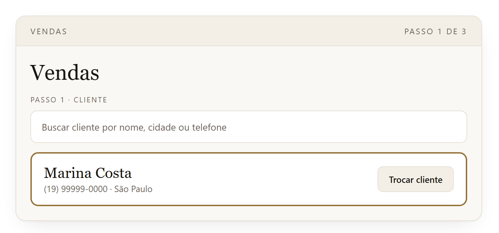
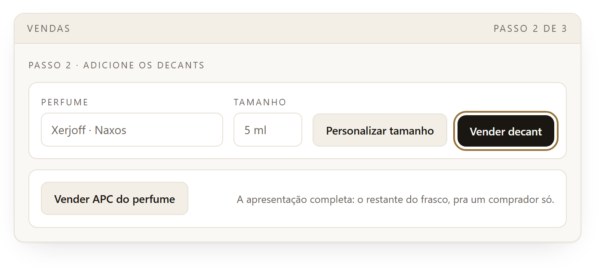
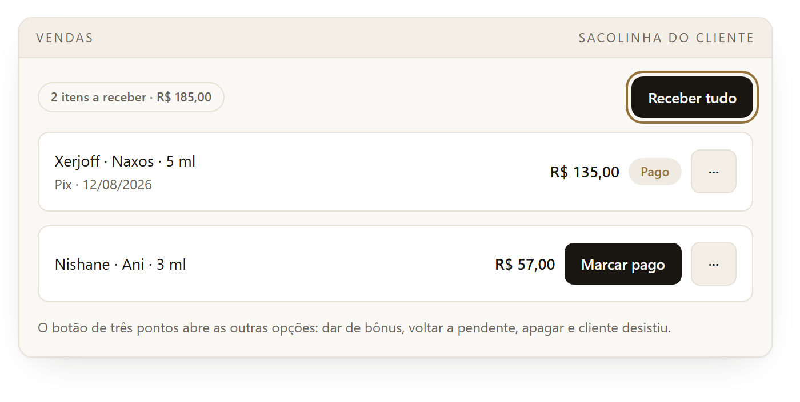
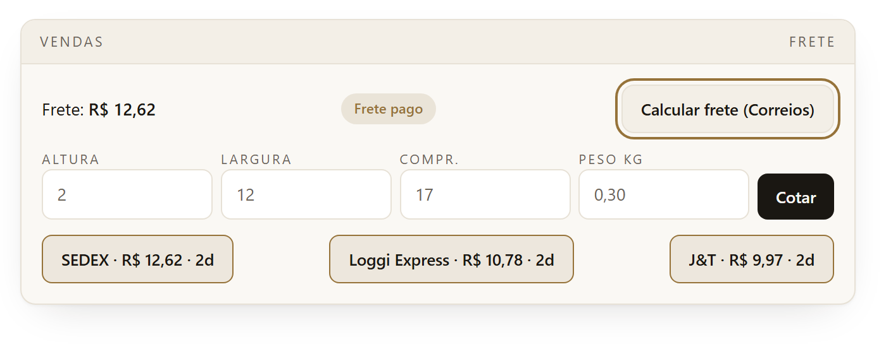
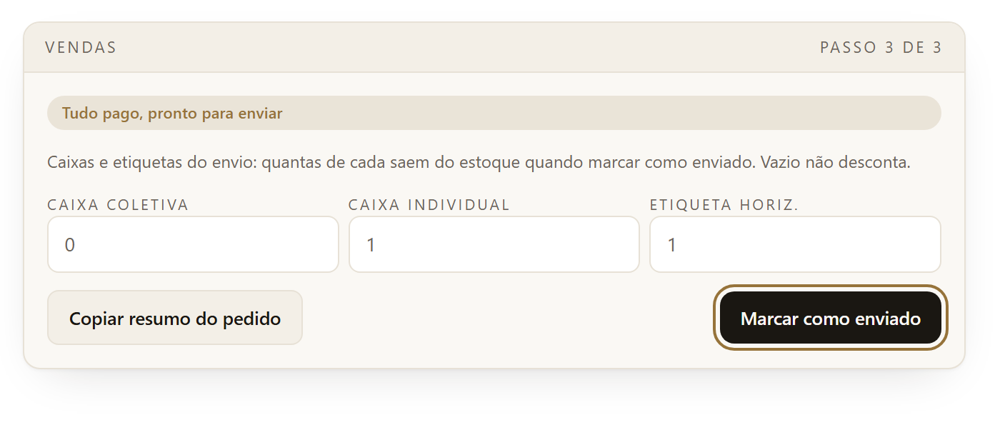
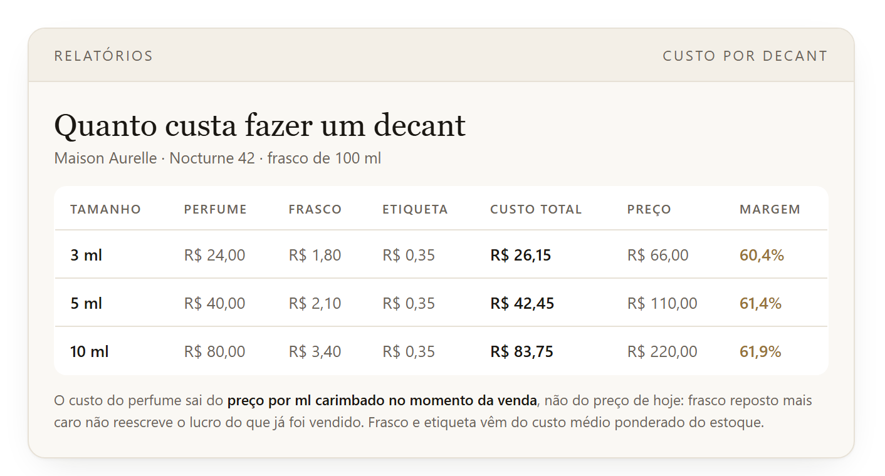

# Acervo: an ERP for fractional perfume retail

*Read in [English](#english) · Leia em [Português](#portugues)*

<a name="english"></a>

I designed and built this ERP for a business that sells decants: imported perfume
bottles split into doses of 3 to 30 ml. It runs in production and covers
inventory, sales, finance, shipping and reporting. The company's website reads
its catalog straight from the same database.

The domain modeling was mine, as were the decisions about where each rule should
live. I wrote the database and the interface, and audited the figures until every
report agreed with the others.

**In production** · infrastructure cost: $0/month

> This is a case study, not the system itself. The source code belongs to the
> company and the database holds real customer data, so what follows documents
> the architecture and shows screens rebuilt with invented data.
>
> I used AI assistance while writing the code.

---

## The problem

The operation ran on spreadsheets and memory. Three things kept going wrong.

Fractional inventory is awkward to track. A 100 ml bottle is not one unit of
anything. It is a balance in millilitres that shrinks with every sale, and part
of it is held back to be sold later as a complete bottle.

Nobody could say which bottles were actually profitable. There was no cost per
millilitre and no sales history, so restocking decisions came down to guesswork.

The website catalog went stale constantly, because taking down whatever had just
sold depended on someone remembering to do it.

Underneath all of it there was no infrastructure worth the name: a personal
Supabase account, cPanel hosting, no deployment process, and no owner at all
after the person who set it up left.

## Result

Scattered spreadsheets gave way to one source of truth covering inventory, sales,
finance and the storefront. A sale now updates stock and the indicators on its
own, the public catalog reads its balance from the same database, and the rules
that must not be broken are enforced inside PostgreSQL rather than in a screen.

For the financial check I recounted the table directly and compared it against
the monthly report, the per-bottle report and the finance dashboard. The four
arrive at the same figures. Infrastructure costs $0 a month, and the main rules
are covered by an end-to-end script of 23 checks that runs against the live
database inside a transaction and rolls everything back at the end.

### Before and after

| Before | After |
|---|---|
| Spreadsheets and memory | One database |
| Fractional stock tracked by hand | Millilitre balance kept automatically |
| Profitability unknown | Profit and margin per bottle |
| Catalog updated manually | Catalog reading live inventory |
| Rules depending on the interface | Critical rules inside PostgreSQL |
| No reliable history | Audit trail of every change |
| Restocking by guesswork | Per-bottle indicators |

## What the system covers

| Module | What it handles |
|---|---|
| **Bottles** | Total cost, price per ml, and the split between the decant area and the full-bottle presentation (APC) |
| **Sales** | Per-customer order, price computed by the database, automatic supply deduction |
| **Finance** | Four states per line item: paid, pending, comped, cancelled |
| **Shipping** | Immediate or scheduled, tracking the packaging materials consumed |
| **Inventory** | Purchases at weighted-average cost, dated history, low-stock alerts, stock counts |
| **Reports** | Revenue, profit, margin, turnover, sales cycle and return on capital per bottle |
| **Public catalog** | Storefront on the company site, reading live inventory |

## Architecture

### Where the business rules live

The rule that matters most is the one the team calls the APC lock. Each bottle
reserves part of its volume to be sold whole, and no decant sale may eat into
that reserve. Written in JavaScript, that guarantee would hold only as long as
every request came through the interface.

It sits in a `BEFORE INSERT` trigger instead, together with price calculation and
the cost snapshot taken at the moment of sale:

```sql
-- Code and error messages are in Portuguese, the language of the team.
-- "TRAVA DO APC" means "APC lock".
v_ml_livres := v_perfume.area_decants_ml - v_perfume.ml_vendidos_decants;
if new.ml > v_ml_livres then
  raise exception 'TRAVA DO APC: este perfume só tem % ml livres na área de decants.',
    v_ml_livres using errcode = 'P0001';
end if;

new.preco_venda := new.ml * v_perfume.valor_venda_por_ml;
new.custo_por_ml_snapshot := v_perfume.custo_por_ml;
```

Shipping while something is still unpaid, selling the same bottle twice, and
returning stock after a reversal are all handled the same way.

### Profit as a generated column

Cost per millilitre derives from the bottle's total cost. The profit on each line
item derives from its price minus the cost stamped on it when it was sold. Since
no screen recalculates either figure, the reports have nothing to drift apart
from.

```sql
custo_por_ml numeric(12,6) generated always as
  (preco_custo_total / volume_total_ml) stored,

lucro numeric(12,4) generated always as
  (preco_venda - (ml * custo_por_ml_snapshot + custo_frasco_snapshot)) stored
```

I checked this by recounting the table directly and comparing the result against
the monthly report, the per-bottle report and the finance dashboard. The four
agree to the cent.

### Security in layers

Every table has Row Level Security. An audit later turned up something I had
missed: the anonymous role still carried Postgres' default grants, which left RLS
as the only thing between an anonymous request and the data. That is one layer,
and one layer is thin for a database holding customer records.

```sql
revoke all on all tables in schema public from anon;
grant select on public.vw_catalogo     to anon;
grant select on public.vw_desistencias to anon;
alter default privileges in schema public revoke all on tables from anon;
```

I then verified it from outside the application: 11 internal endpoints answer
401, and only the two storefront views answer 200.

### An audit trail nobody can edit

Changes to payment, price, bottle configuration and shipping are recorded with
the old value, the new value, who made the change and when. The table carries no
`UPDATE` or `DELETE` policy, so the history cannot be rewritten by anyone,
administrators included.

### The website reads the same database

The public catalog is a view, `vw_catalogo`, which Next.js reads with 60-second
revalidation. When something sells in the system it leaves the site without
anyone touching it, and if a customer backs out the decant returns under a
"back in stock" tab.

<a name="screens"></a>

## Screens

These are rebuilt versions of the real screens. Every name, perfume, price and
figure in them is invented; there is no customer data and no company figure
anywhere. The interface is in Portuguese, which is the language of the people who
use it.

### Sales: building an order



### Finance: one click closes the order


### Shipping: live carrier quotes


### Fulfilment: packaging consumption


### Reports: what a decant costs to make


## Size of the project

| | |
|---|---|
| SQL migrations | 56 |
| Lines of SQL | ~5,800 |
| Database objects | 14 views, 17 functions |
| React screens | 14 |
| Lines of JS/JSX | ~7,600 |
| End-to-end rule script | 23 checks, run inside a rolled-back transaction |

## Stack

**Frontend** React 19 · Vite · Tailwind CSS v4 · TanStack Query · react-hook-form · Zod
**Database** PostgreSQL (Supabase) with RLS, triggers, generated columns and views
**Integrations** Melhor Envio shipping quotes through a Deno Edge Function
**Infra** Vercel (push to deploy) · weekly automated backups via GitHub Actions

## What I took away from it

Putting the business rules in the database earned back the effort it cost. During
testing, whenever a screen tried something invalid, the database refused it with
a message the team could actually read. Keeping those rules in the frontend would
have meant reimplementing the same guard on every screen I added afterwards.

The worst bug in the project was silent, and nothing automated caught it. The
interface began sending payment status in one shape while the write function
still expected the previous one. It compiled, raised no error, and quietly saved
everything as pending. What surfaced it was sitting down and working through the
system as a user would, following a written script.

Counting a comped item as a sale distorts everything downstream of it. A giveaway
takes stock out but brings no money in, so treating it as revenue skews rankings,
average ticket and margin. I noticed when a bottle that had been given away as a
courtesy came out on top of the best-seller list.

A fair share of the work had nothing to do with code. Simplifying screens,
cutting jargon and writing a manual in plain language mattered as much as the
schema did, because the people running this system are not technical and needed
to work without me.

---

<a name="portugues"></a>

# Acervo: um ERP para perfumaria fracionada

Projetei e construí este ERP para uma operação que vende decants: frascos de
perfume importado fracionados em doses de 3 a 30 ml. Está em produção e cobre
estoque, vendas, financeiro, entregas e relatórios. O site da empresa lê o
catálogo direto do mesmo banco.

A modelagem do domínio foi minha, assim como as decisões sobre onde cada regra
deveria ficar. Escrevi o banco e a interface, e auditei os números até um
relatório concordar com o outro.

**Em produção** · custo de infraestrutura: R$ 0/mês

> Isto é um estudo de caso, não o sistema. O código-fonte pertence à empresa e o
> banco guarda dados reais de clientes, então o que vem abaixo documenta a
> arquitetura e mostra telas refeitas com dados inventados.
>
> Usei auxílio de IA na escrita do código.

---

## O problema

A operação era tocada por planilha e memória. Três coisas davam errado o tempo
todo.

Estoque fracionado é chato de controlar. Um frasco de 100 ml não é uma unidade de
nada: é um saldo em mililitros que diminui a cada venda, e parte dele fica
guardada para ser vendida depois como frasco inteiro.

Ninguém sabia dizer quais frascos davam lucro de verdade. Não havia custo por
mililitro nem histórico de vendas, então a decisão de recomprar era no achismo.

O catálogo do site vivia desatualizado, porque tirar do ar o que tinha acabado de
vender dependia de alguém lembrar.

Por baixo de tudo isso não havia infraestrutura nenhuma: uma conta pessoal do
Supabase, hospedagem cPanel, nenhum processo de deploy e nenhum dono depois que a
pessoa que montou aquilo saiu.

## Resultado

As planilhas espalhadas deram lugar a uma fonte única de dados cobrindo estoque,
vendas, financeiro e catálogo. Hoje uma venda atualiza o estoque e os indicadores
sozinha, o catálogo público lê o saldo do mesmo banco, e as regras que não podem
ser furadas ficam protegidas dentro do PostgreSQL, não numa tela.

Na validação financeira, recontei a tabela direto e comparei com o relatório
mensal, o relatório por frasco e o painel financeiro. Os quatro chegam aos mesmos
valores. A infraestrutura custa R$ 0 por mês, e as regras principais têm um
script de 23 verificações que roda contra o banco real dentro de uma transação e
desfaz tudo no fim.

### Antes e depois

| Antes | Depois |
|---|---|
| Controle em planilhas e memória | Banco centralizado |
| Estoque fracionado na mão | Saldo automático por ml |
| Rentabilidade desconhecida | Lucro e margem por frasco |
| Catálogo atualizado manualmente | Catálogo lendo estoque real |
| Regras dependentes da interface | Regras críticas no PostgreSQL |
| Sem histórico confiável | Auditoria de alterações |
| Reposição no achismo | Indicadores por frasco |

## O que o sistema cobre

| Módulo | O que resolve |
|---|---|
| **Perfumes** | Custo total, preço por ml e a divisão entre área de decants e apresentação completa (APC) |
| **Vendas** | Pedido por cliente, preço calculado pelo banco, baixa automática de insumos |
| **Financeiro** | Quatro estados por item: pago, pendente, bônus e cancelado |
| **Entregas** | Imediata ou programada, com controle do material de envio consumido |
| **Estoque** | Compras a custo médio ponderado, histórico datado, alertas e contagem de inventário |
| **Relatórios** | Faturamento, lucro, margem, giro, ciclo de venda e retorno sobre capital por frasco |
| **Catálogo público** | Vitrine no site institucional, lendo o estoque real |

## Arquitetura

### Onde as regras de negócio ficam

A regra mais importante é a que a equipe chama de trava do APC. Cada frasco
reserva parte do volume para ser vendido inteiro, e nenhuma venda de decant pode
invadir essa reserva. Escrita em JavaScript, essa garantia valeria só enquanto
toda requisição passasse pela interface.

Ela fica num trigger `BEFORE INSERT`, junto do cálculo de preço e do carimbo de
custo no momento da venda:

```sql
-- O decant precisa caber na área reservada aos decants.
v_ml_livres := v_perfume.area_decants_ml - v_perfume.ml_vendidos_decants;
if new.ml > v_ml_livres then
  raise exception 'TRAVA DO APC: este perfume só tem % ml livres na área de decants.',
    v_ml_livres using errcode = 'P0001';
end if;

new.preco_venda := new.ml * v_perfume.valor_venda_por_ml;
new.custo_por_ml_snapshot := v_perfume.custo_por_ml;
```

Enviar com item em aberto, vender o mesmo frasco duas vezes e devolver estoque
depois de um estorno são tratados do mesmo jeito.

### Lucro como coluna gerada

O custo por mililitro deriva do custo total do frasco. O lucro de cada item
deriva do preço menos o custo carimbado nele na hora da venda. Como nenhuma tela
recalcula esses números, não existe de onde os relatórios divergirem.

```sql
custo_por_ml numeric(12,6) generated always as
  (preco_custo_total / volume_total_ml) stored,

lucro numeric(12,4) generated always as
  (preco_venda - (ml * custo_por_ml_snapshot + custo_frasco_snapshot)) stored
```

Conferi recontando a tabela direto e comparando o resultado com o relatório
mensal, o relatório por frasco e o painel financeiro. Os quatro batem ao centavo.

### Segurança em camadas

Todas as tabelas têm Row Level Security. Uma auditoria depois apontou algo que eu
tinha deixado passar: o papel anônimo ainda carregava os grants padrão do
Postgres, o que deixava a RLS como única coisa entre uma requisição anônima e os
dados. Isso é uma camada, e uma camada é pouco para um banco com cadastro de
cliente.

```sql
revoke all on all tables in schema public from anon;
grant select on public.vw_catalogo     to anon;
grant select on public.vw_desistencias to anon;
alter default privileges in schema public revoke all on tables from anon;
```

Depois verifiquei por fora da aplicação: 11 endpoints internos respondem 401, e
só as duas views da vitrine respondem 200.

### Uma trilha de auditoria que ninguém edita

Mudanças em pagamento, preço, configuração do frasco e envio ficam registradas
com o valor antigo, o valor novo, quem mudou e quando. A tabela não tem política
de `UPDATE` nem de `DELETE`, então o histórico não pode ser reescrito por
ninguém, administrador incluído.

### O site lê o mesmo banco

O catálogo público é uma view, `vw_catalogo`, que o Next.js lê com revalidação a
cada 60 segundos. Quando algo vende no sistema, sai do site sem ninguém mexer, e
se o cliente desiste o decant volta numa aba de "voltaram ao acervo".

## Telas

São as mesmas imagens da versão em inglês: [ver a seção Screens](#screens). Todo
nome, perfume, preço e número nelas é inventado; não há dado de cliente nem
número da empresa em lugar nenhum.

## Tamanho do projeto

| | |
|---|---|
| Migrações SQL | 56 |
| Linhas de SQL | ~5.800 |
| Objetos no banco | 14 views, 17 funções |
| Telas React | 14 |
| Linhas de JS/JSX | ~7.600 |
| Script de regras ponta a ponta | 23 verificações, em transação com rollback |

## Stack

**Frontend** React 19 · Vite · Tailwind CSS v4 · TanStack Query · react-hook-form · Zod
**Banco** PostgreSQL (Supabase) com RLS, triggers, colunas geradas e views
**Integrações** Cotação de frete do Melhor Envio via Edge Function em Deno
**Infra** Vercel (deploy por push) · backup semanal automatizado em GitHub Actions

## O que eu tirei disso

Colocar as regras de negócio no banco pagou o esforço que custou. Durante os
testes, sempre que uma tela tentava algo inválido o banco recusava com uma
mensagem que a equipe conseguia ler. Deixar essas regras no frontend teria
significado reimplementar a mesma proteção em cada tela nova que eu fizesse.

O pior bug do projeto foi silencioso, e nenhuma verificação automática pegou. A
interface passou a mandar o status de pagamento num formato enquanto a função de
gravação continuava esperando o anterior. Compilava, não levantava erro nenhum e
salvava tudo como pendente, quieto. O que revelou foi sentar e percorrer o
sistema como um usuário faria, seguindo um roteiro escrito.

Contar um bônus como venda distorce tudo o que vem depois dele. Uma cortesia tira
produto do estoque e não traz dinheiro, então tratar como faturamento desequilibra
ranking, ticket médio e margem. Percebi quando um frasco dado de cortesia apareceu
em primeiro lugar na lista dos mais vendidos.

Boa parte do trabalho não teve nada a ver com código. Simplificar tela, cortar
jargão e escrever manual em linguagem de gente pesou tanto quanto o schema,
porque quem opera esse sistema não é técnico e precisava trabalhar sem mim.

---

**Paulo Rabelo** · [LinkedIn](https://www.linkedin.com/in/paulorabeloo) ·
[GitHub](https://github.com/Paulorabeloo)
